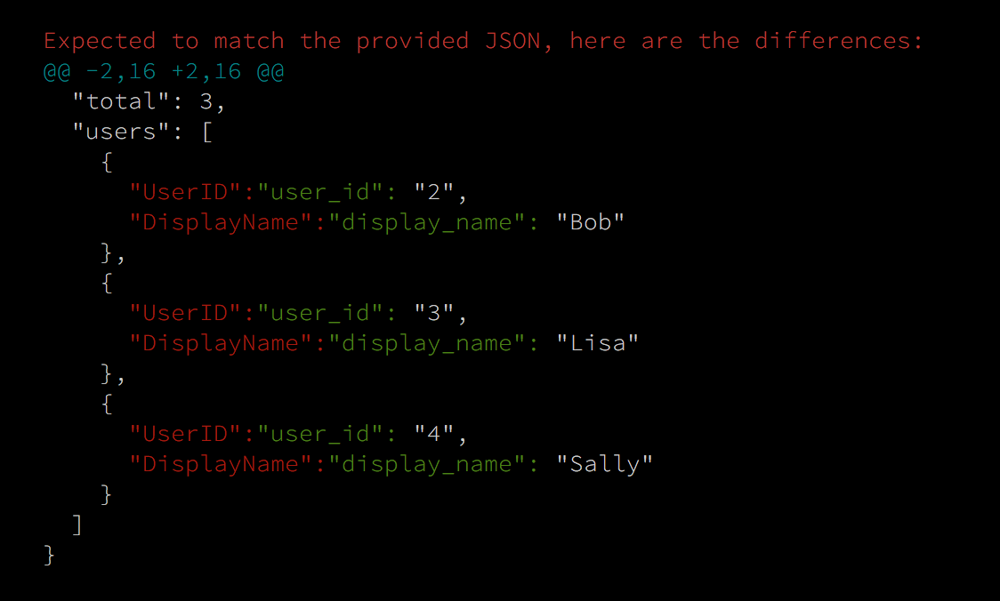
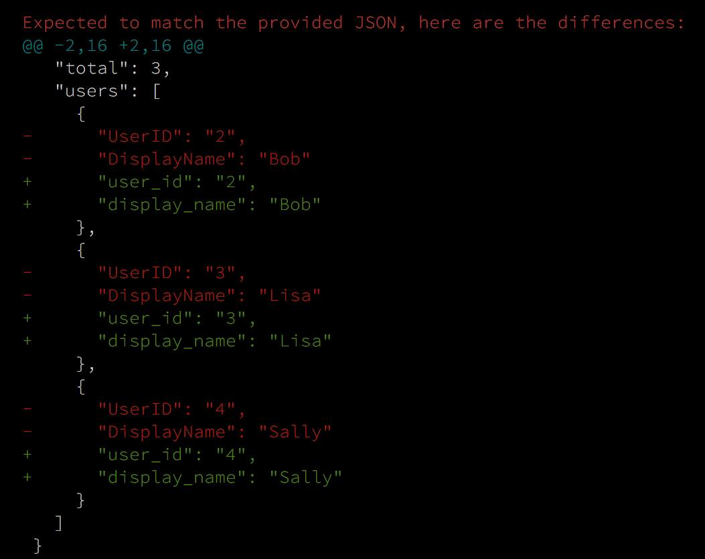

# muhqu's Gomega Additions

## `worddiff.MatchJSON`

Is a [GomegaMatcher][] that uses [json.Indent][] to format the _actual_ and _expected_ JSON in a consistent way and then uses the git command line
tool to generate a colored word-diff.

The following command is used to generate the diff:

    git diff --word-diff=color --ignore-space-at-eol -- tempfile_actual.json  tempfile_expected.json

The result looks like this:

## `unifieddiff.MatchJSON`

Is a [GomegaMatcher][] that uses [json.Indent][] to format the _actual_ and _expected_ JSON in a consistent way and then uses the git command line
tool to generate a colored [Unified Diff][].

The following command is used to generate the diff:

    git diff -u --color --ignore-space-at-eol -- tempfile_actual.json  tempfile_expected.json

The result looks like this:

[GomegaMatcher]: http://onsi.github.io/gomega/#provided-matchers
[json.Indent]: https://golang.org/pkg/encoding/json/#Indent
[unified-diff]: https://en.wikipedia.org/wiki/Diff_utility#Unified_format